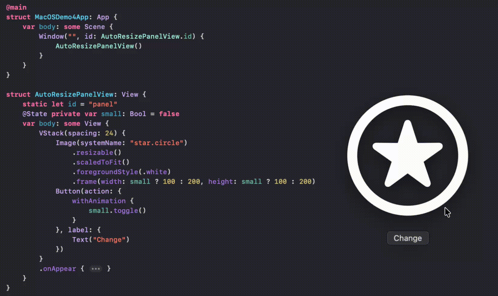

# SwiftUI_MacOS_AutoResizePanel

A demo of Auto Window/Panel Resizing Based on Some State (No NSWindow/NSPanel subclass. No Manual setFrame. Just a SwiftUI View.)

For more details, please refer to my blog [SwiftUI/MacOS: Auto Window/Panel Resizing Based on Some State]()

